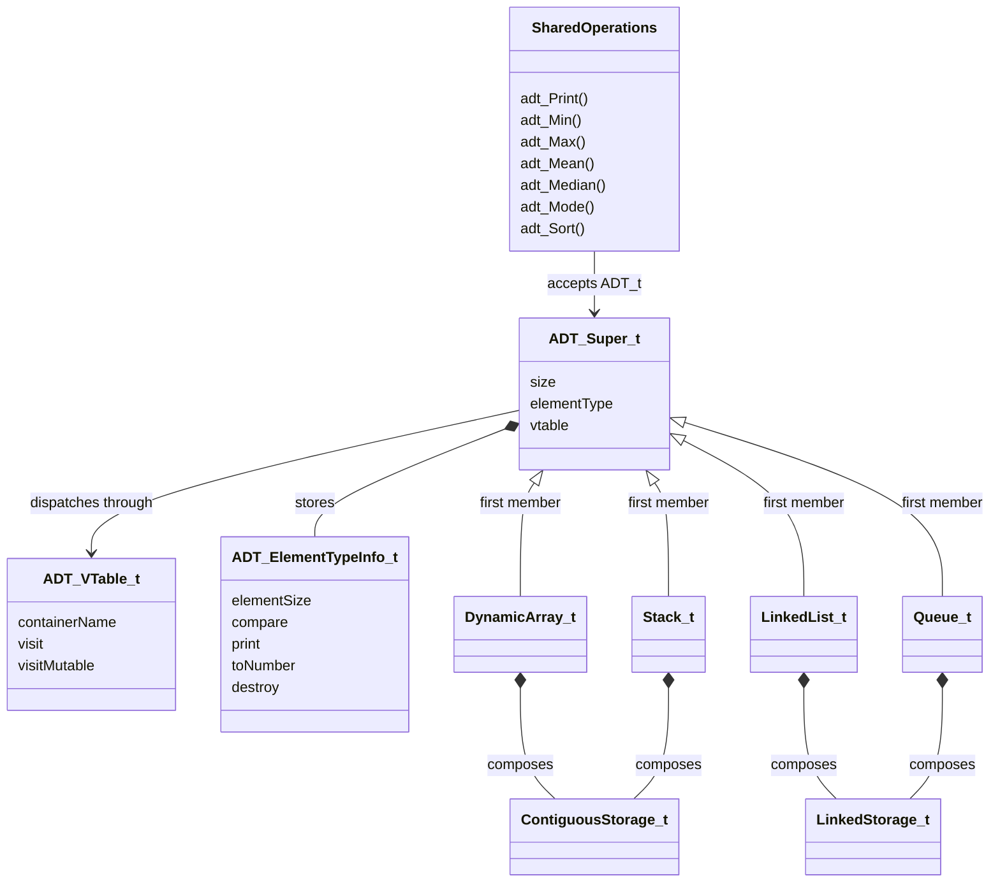

# libadt

libadt is a C23 abstract data type library and my CS3003 Programming Languages
final project. It started as a generic dynamic array and grew into dynamic
arrays, doubly linked lists, stacks, and queues with shared algorithms. Under
the API, it uses type erasure, compile-time generic dispatch, runtime
polymorphism, composition, and explicit memory ownership.

**Course:** Programming Languages (CS3003)

**Term:** Summer 2026

## Quick start

The library requires a compiler with C23 support. The tests also require
CppUTest.

```sh
make build
make test
make -C examples
```

```c
#include "libadt/libadt.h"

int main(void)
{
    int values[] = {3, 1, 2};
    DynamicArray_t numbers = {0};

    DA_INIT_FROM(&numbers, values);
    da_Append(&numbers, 4);
    adt_Sort(&numbers, ADT_SORT_QUICK);
    adt_Print(&numbers);

    da_Destroy(&numbers);
    return 0;
}
```

Output:

```text
DynamicArray (size: 4): [1, 2, 3, 4]
```

The return checks are omitted here to keep the first example focused on the
API and its result. The [getting-started guide](docs/getting_started.md) shows
the guarded version to use as a starting point for application code.

## What the library provides

Include the complete supported API with one header:

```c
#include "libadt/libadt.h"
```

The individual container headers remain available when a program wants a
smaller, selective include.

### Four concrete ADTs

| ADT | Representation | Main operations | Best fit |
| --- | --- | --- | --- |
| `DynamicArray_t` | Resizable contiguous storage | `da_Get`, `da_Set`, `da_Insert`, `da_Append`, `da_Take` | Indexed access and cache-friendly sequences |
| `LinkedList_t` | Doubly linked nodes | `ll_Get`, `ll_Insert`, `ll_Prepend`, `ll_Append`, `ll_Take` | Frequent insertion without shifting elements |
| `Stack_t` | Contiguous storage | `st_Push`, `st_Peek`, `st_Pop`, `st_Discard` | Last-in, first-out behavior |
| `Queue_t` | Linked storage | `qu_Enqueue`, `qu_Front`, `qu_Back`, `qu_Dequeue` | First-in, first-out behavior |

Dynamic arrays and stacks reuse `ContiguousStorage_t`. Linked lists and queues
reuse `LinkedStorage_t`. The concrete ADTs add their own public operations,
type behavior, ownership rules, and polymorphic traversal.

### Generic element operations

The container internals are type-erased: element operations work with `void *`
and an element size instead of a concrete C type. C23 `_Generic` performs
compile-time dispatch so supported primitives still use natural pass-by-value
syntax:

```c
st_Push(&numbers, 5);
qu_Enqueue(&requests, 10);
```

Custom and pointer-based element types are passed by address:

```c
Student_t student = {.id = 1001};
da_Append(&students, &student);
```

The default `_Generic` association uses the reference implementation for
custom types, pointers, and function pointers. In every case, the argument
must match the element type used to initialize the container.

### Runtime element behavior

After type erasure, `ADT_ElementTypeInfo_t` acts as the runtime element
descriptor:

| Member | Purpose |
| --- | --- |
| `elementSize` | Controls allocation and byte copying |
| `compare` | Defines equality and ordering |
| `print` | Prints one element |
| `toNumber` | Converts one element for numeric statistics |
| `destroy` | Releases resources owned by one logical element |

Initialization macros automatically configure these callbacks for `char`,
`int`, `unsigned int`, `long`, `float`, and `double`. Custom types provide
their own callbacks when needed.

### One shared API across every ADT

Functions prefixed with `adt_` accept any initialized libadt container:

```c
adt_Print(&container);
adt_Min(&container, &minimum);
adt_Max(&container, &maximum);
adt_Mean(&container, &mean);
adt_Median(&container, &median);
adt_Mode(&container, &mode);
adt_Sort(&container, ADT_SORT_QUICK);
```

The library includes bubble, selection, insertion, quick, and bounded bogo
sort—the last one mostly because a sorting library is more fun with one
deliberately terrible algorithm. `adt_SortBy` and the `By` statistics functions
accept per-call callback overrides for alternate interpretations of a type.
These shared functions use dynamic dispatch through the container's traversal
vtable.

### Explicit ownership and safety

Containers own their element storage and make shallow copies. The API
distinguishes non-owning copies, destruction, and ownership transfer:

| Behavior | Operations |
| --- | --- |
| Copy without removal | `Get`, `Peek`, `Front`, `Back`, `Min`, `Max` |
| Remove and destroy owned resources | `Remove`, `Discard`, `Clear`, `Destroy` |
| Remove and transfer resource ownership | `Take`, `Pop`, `Dequeue` |

The implementation checks invalid arguments, indexes, size overflow,
allocation failures, primitive-size mismatches, and unsafe storage aliasing.
C cannot completely recover or verify a custom type after conversion to
`void *`, so callers must still pass the type used at initialization.

## Design relationships



The inheritance arrows represent **structural inheritance**, not C language
inheritance. Every concrete container places `ADT_Super_t` at offset zero, so
its address can be treated as the shared base address. Static assertions
protect that layout.

The diamond relationships show **composition**. Concrete containers contain a
storage component and delegate raw memory management to it. Storage components
do not inherit from `ADT_Super_t`; they manage bytes and links without knowing
the public behavior or meaning of an element.

Shared operations receive an `ADT_t *` and call the active container's
traversal functions through `ADT_VTable_t`. This provides runtime polymorphism
without requiring every concrete operation to exist in the shared vtable.

## Examples

The checked quick-start examples demonstrate normal error handling. A separate
`basic.c` for each ADT performs operations without branching on every return
value, making it easy to watch the container change:

```sh
make -C examples dynamic-array-basic
make -C examples linked-list-basic
make -C examples stack-basic
make -C examples queue-basic
```

See [all compilable examples](examples/README.md) for custom types, ownership,
statistics, sorting, debugging, and polymorphism demonstrations.

## Documentation

- [Getting started](docs/getting_started.md)
- [Dynamic arrays](docs/dynamic_array.md)
- [Linked lists](docs/linked_list.md)
- [Stacks](docs/stack.md)
- [Queues](docs/queue.md)
- [Storage composition](docs/storage.md)
- [Polymorphism](docs/polymorphism.md)
- [Custom element types](docs/custom_types.md)
- [Runtime type information](docs/runtime_type_info.md)
- [Ownership and shallow copying](docs/ownership.md)
- [Numeric statistics](docs/statistics.md)

## Repository structure

```text
include/libadt/
├── libadt.h
├── abstract_data_type.h
├── dynamic_array.h
├── linked_list.h
├── stack.h
├── queue.h
├── element/
│   ├── comparators.h
│   ├── number_converters.h
│   └── printers.h
└── internal/
    ├── storage/
    │   ├── contiguous_storage.h
    │   └── linked_storage.h
    ├── dynamic_array_operations.h
    ├── linked_list_operations.h
    ├── stack_operations.h
    ├── queue_operations.h
    └── primitive_dispatch.h

src/
├── shared/
│   ├── abstract_data_type.c
│   ├── statistics.c
│   ├── sorting.c
│   ├── element/
│   └── storage/
└── containers/
    ├── dynamic_array/
    ├── linked_list/
    ├── stack/
    └── queue/
```

# Final project write-up

## Project summary

For this project, I built a generic C23 library with dynamic arrays, doubly
linked lists, stacks, and queues. They support primitive and custom element
types and share printing, sorting, extrema, and numeric statistics.

I wanted the project to go beyond four separate container implementations. The
interesting part was figuring out how far I could take inheritance,
polymorphism, encapsulation, and generic programming in C without trying to
make C look exactly like C++.

## Connections to course concepts

| Course concept | Connection to the implementation |
| --- | --- |
| Imperative programming | Algorithms use explicit control flow, mutable state, pointer arithmetic, allocation, and deterministic cleanup. |
| Abstract data types | Public operations define each container's behavior while hiding storage manipulation and preserving invariants. |
| Encapsulation | API boundaries, `_private` members, and `internal` headers approximate information hiding without C access modifiers. |
| Composition and delegation | Containers delegate allocation and mutation to reusable contiguous or linked storage components. |
| Structural inheritance and upcasting | First-member embedding gives every container an `ADT_Super_t` base at offset zero, allowing conversion to `ADT_t *`. |
| Runtime polymorphism and dynamic dispatch | Shared `adt_*` algorithms call representation-specific traversal through `ADT_VTable_t`. |
| Compile-time polymorphism and generic programming | C23 `_Generic` selects primitive value wrappers while the default association accepts custom types by reference. |
| Type erasure and runtime metadata | `void *` removes the concrete element type inside the container; `ADT_ElementTypeInfo_t` restores the operations needed at runtime. |
| Higher-order functions | Comparators, printers, numeric projections, destructors, and visitors are callbacks passed as function pointers. |
| Manual ownership and resource management | Shallow copies, destroy callbacks, and transfer operations make allocation ownership and object lifetime explicit. |

## How the design changed and what I learned

The project started with a dynamic array and direct `void *` operations. As I
added more containers, I had to separate element dispatch, shared behavior,
storage reuse, and resource ownership instead of treating them as one generic
container problem.

### `_Generic`: clean calls without separate APIs

The first version made an integer append look like `&(int){5}`. It worked, but
it made a basic container operation feel more complicated than it should.

- I considered separate `AppendValue` and `AppendRef` functions.
- That made the implementation visible in every call site.
- I settled on C23 `_Generic` to select the correct wrapper at compile time.

```c
da_Append(&numbers, 5);
da_Append(&students, &student);
```

The first call selects an `int` value wrapper; the second uses the default
reference path. This provides compile-time polymorphism without duplicating
public operation names.

The tradeoff is real: macro expansion can make compiler and editor diagnostics
less direct. That is one of the places where a cleaner API and better tooling
do not perfectly line up in C.

### `ADT_Super_t`: inheritance through layout

Once every container needed a size, element descriptor, and vtable, I did not
want four unrelated copies of the same base state.

- Each concrete container embeds `ADT_Super_t` as its first member.
- The common initial layout allows an upcast to `ADT_t *`.
- Static assertions protect the offset-zero requirement.

This is structural inheritance by convention, not compiler-supported class
inheritance. Working through it made the difference between sharing data
layout and inheriting behavior much more concrete.

### Vtables: behavior chosen at runtime

The shared base solved the layout problem, but not the behavior problem. An
array walks contiguous memory; a linked list follows nodes.

- `ADT_VTable_t.visit` provides read-only traversal.
- `ADT_VTable_t.visitMutable` provides mutable traversal.
- Each container installs its traversal functions during initialization.

Now `adt_Print`, statistics, and sorting use dynamic dispatch through
`ADT_t *`. The vtable gives the project runtime polymorphism, while `_Generic`
handles a different problem at compile time.

### Type erasure made behavior explicit

Once the concrete element type becomes `void *`, `sizeof(type)` is not enough.
The library still needs to know how that type behaves.

`ADT_ElementTypeInfo_t` became a runtime descriptor containing:

- element size for allocation and shallow copying;
- a comparator for equality and ordering;
- a printer for display;
- a numeric projection for statistics;
- a destructor for element-owned resources.

This also exposed an ownership question I had not needed to think about with
plain integers. Copying a structure does not clone the memory referenced by
its pointer fields. The API now separates destructive removal from ownership
transfer, and the documentation states who owns a resource after each call.

### Composition below the public ADTs

I first considered implementing stack and queue as wrappers around the dynamic
array and linked list. Instead, I extracted `ContiguousStorage_t` and
`LinkedStorage_t`.

That gave me the reuse I wanted without pretending a stack *is a* dynamic
array or a queue *is a* linked list. The ADTs compose storage components and
delegate raw allocation to them while keeping their own interfaces and
invariants.

### C still sets the boundaries

Some abstractions remain conventions because the language cannot enforce
them:

- Public stack allocation requires complete container layouts in headers.
- `_private` member groups signal internal state but do not prevent access.
- `internal` headers document an unsupported boundary rather than creating a
  true private module.
- `_Generic` improves call syntax but cannot completely verify a type after it
  enters the type-erased API.

Those constraints are not just drawbacks; they are part of what made C useful
for this project. I had to decide which guarantees the library could enforce
and which ones it could only document clearly.

## Testing and development

I used CppUTest for normal operations, invalid arguments, ownership, overflow,
aliasing, primitive and custom types, function pointers, shared traversal,
statistics, and sorting. AddressSanitizer and UndefinedBehaviorSanitizer add
memory checks that ordinary unit tests can miss.

```sh
make test
make sanitize
```

I developed the repository incrementally instead of uploading one final
version. The commit history follows the same path as the design: containers,
storage refactoring, polymorphism, primitive support, statistics, sorting,
tests, examples, and documentation.

## Limitations and future work

What the current version still does not solve:

- Custom elements are shallow-copied; there is no automatic clone callback.
- Allowing local, stack-allocated containers prevents fully private layouts.
- A live container must be destroyed before it is initialized again.
- `_Generic` improves call syntax but does not provide complete type safety.

Where I would take it next:

- Add non-linear and associative ADTs such as trees, maps, and sets.
- Test whether the shared traversal model still works well beyond linear
  sequences.
- Add key-specific metadata or hashing for maps and sets.
- Consider an optional clone callback for custom types that need deep copies.

Detailed API and design explanations are available in the linked documentation.
