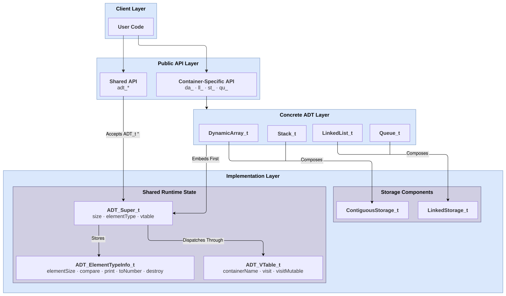

# libadt

libadt is a C23 abstract data type library created for my CS3003 Programming Languages final project. It provides dynamic arrays, doubly linked lists, stacks, and queues with shared algorithms. Under the API, it uses type erasure, compile-time generic dispatch, runtime polymorphism, composition, and explicit memory ownership.

- **Author:** Isaac Niedens
- **Course:** CS3003 — Programming Languages
- **University:** University of Cincinnati — College of Engineering and Applied Science
- **Term:** Summer 2026

___

## Quick Start

The library requires a compiler with C23 support. The tests also require CppUTest.

```sh
make build
make test
make -C examples
```

```c
#include "libadt/libadt.h"

int main(void)
{
    int values[] = {3, 1, 2};
    DynamicArray_t numbers = {0};

    DA_INIT_FROM(&numbers, values);
    da_Append(&numbers, 4);
    adt_Sort(&numbers, ADT_SORT_QUICK);
    adt_Print(&numbers);

    da_Destroy(&numbers);
    return 0;
}
```

Output:

```text
DynamicArray (size: 4): [1, 2, 3, 4]
```

The return checks are omitted here to keep the first example focused on the API and its result. The [getting-started guide](docs/getting_started.md) shows the guarded version to use as a starting point for application code.

## What the Library Provides

Include the complete supported API with one header:

```c
#include "libadt/libadt.h"
```

The individual container headers remain available when a program wants smaller, selective includes. When using selective includes, include `libadt/abstract_data_type.h` explicitly for the shared `ADT_t` functionality, then include the headers for the concrete containers the program uses. The shared header provides traversal, size and element-type inspection, printing and debug output, extrema, numeric statistics, and sorting for every initialized libadt container.

### ADT Interfaces

| ADT | Backing Representation | Main Operations | Best Fit |
| --- | --- | --- | --- |
| `DynamicArray_t` | `ContiguousStorage_t`: resizable contiguous allocation | `da_Get`, `da_Set`, `da_Insert`, `da_Append`, `da_Take` | Indexed access and cache-friendly sequences |
| `LinkedList_t` | `LinkedStorage_t`: doubly linked nodes | `ll_Get`, `ll_Insert`, `ll_Prepend`, `ll_Append`, `ll_Take` | Frequent insertion without shifting elements |
| `Stack_t` | `ContiguousStorage_t`: resizable contiguous allocation | `st_Push`, `st_Peek`, `st_Pop`, `st_Discard` | Last-in, first-out behavior |
| `Queue_t` | `LinkedStorage_t`: doubly linked nodes | `qu_Enqueue`, `qu_Front`, `qu_Back`, `qu_Dequeue` | First-in, first-out behavior |
| `ADT_t` | No storage of its own; operates through `ADT_Super_t` and the concrete container's vtable | `adt_ForEach`, `adt_ForEachMutable`, `adt_Size`, `adt_IsEmpty`, `adt_ElementType`, `adt_Print`, `adt_PrintDebug`, `adt_Min`, `adt_Max`, `adt_Mean`, `adt_Median`, `adt_Mode`, `adt_Sort`<br><br>`adt_MinBy`, `adt_MaxBy`, `adt_MeanBy`, `adt_MedianBy`, `adt_ModeBy`, `adt_SortBy` — these functions take a callback override to define custom behavior | Shared operations across every concrete ADT; primitive callbacks are automatic, while custom types supply them through `ADT_ElementTypeInfo_t` |

Some ADTs share the same storage component. Dynamic arrays and stacks use `ContiguousStorage_t`, while linked lists and queues use `LinkedStorage_t`. They remain different ADTs because they expose different operations and use that storage differently.

Shared `adt_*` operations dispatch through each concrete container's vtable. Traversal takes a visitor directly; printing, extrema, statistics, and sorting use the element descriptor, with `adt_*By` functions providing per-call overrides. These requirements are detailed under [Runtime Element Type Information](#runtime-element-type-information).

### Initialization Forms

Prefixes are `DA`/`LL`/`ST`/`QU` for macros and `da`/`ll`/`st`/`qu` for functions. Italicized names are placeholders.

| Form | Call Pattern | Purpose |
| --- | --- | --- |
| `*_INIT` | (*container*, *primitive type*) | Empty primitive container |
| `*_INIT_FROM` | (*container*, *primitive type* *values*`[N]`) | Copy a primitive C array |
| `*_Init` | (*container*, `ADT_ElementTypeInfo_t` *elementType*) | Empty container with explicit behavior |
| `*_InitFrom` | (*container*, `const void *` *elements*, `size_t` *count*, `ADT_ElementTypeInfo_t` *elementType*) | Copy elements with explicit behavior |

- `From`/`FROM` preloads copies.
- Zero-initialize the container first.
- Every form returns `bool` based on initialization success.
- See [Initialization Forms](docs/getting_started.md#initialization-forms) for details.

### Generic Element Operations

The container internals are type-erased: element operations work with `void *` and an element size instead of a concrete C type. C23 `_Generic` performs compile-time dispatch so supported primitives still use natural pass-by-value syntax:

```c
st_Push(&numbers, 5);
qu_Enqueue(&requests, 10);
```

Custom and pointer-based element types are passed by address:

```c
Student_t student = {.id = 1001};
da_Append(&students, &student);
```

The default `_Generic` association uses the reference-based implementation for custom types, pointers, and function pointers. In every case, the argument must match the element type used to initialize the container.

### One Shared API Across Every ADT

Functions prefixed with `adt_` accept any initialized libadt container:

```c
adt_Print(&container);
adt_Min(&container, &minimum);
adt_Max(&container, &maximum);
adt_Mean(&container, &mean);
adt_Median(&container, &median);
adt_Mode(&container, &mode);
adt_Sort(&container, algorithm);
// algorithm can be:
//     ADT_SORT_BUBBLE, ADT_SORT_SELECTION, ADT_SORT_INSERTION,
//     ADT_SORT_QUICK, or ADT_SORT_BOGO
```

These shared functions use dynamic dispatch through the container's traversal vtable.

The library includes bubble, selection, insertion, quick, and bogo sort. I included bogo sort as an intentionally impractical demonstration of the shared sorting interface. The algorithm names are defined by the `ADT_SortAlgorithm_t` enum in `include/libadt/abstract_data_type.h`. Adding another algorithm requires adding an enum value and implementing its dispatch in `src/shared/sorting.c`; `adt_SortBy` supplies a custom comparator for an existing algorithm rather than a new sorting algorithm.

### Runtime Element Type Information

After type erasure, `ADT_ElementTypeInfo_t` acts as the runtime element descriptor:

| Member | Type | Purpose |
| --- | --- | --- |
| `elementSize` | `size_t` | Controls allocation and byte copying. Used by initialization, storage, and element-copying operations. |
| `compare` | `CompareFn_t` : `int (*)(const void *, const void *)` | Defines equality and ordering. Used by `*_IndexOf`, `*_Contains`, `adt_Min`, `adt_Max`, and `adt_Sort`. |
| `print` | `PrintFn_t` : `void (*)(const void *)` | Prints one element. Used by `adt_Print` and `adt_PrintDebug`. |
| `toNumber` | `ToNumberFn_t` : `double (*)(const void *)` | Converts one element to `double`. Used by `adt_Mean`, `adt_Median`, and `adt_Mode`. |
| `destroy` | `DestroyFn_t` : `void (*)(void *)` | Releases element-owned resources. Used by `*_Set`, `*_Remove`, `*_Discard`, `*_Clear`, and `*_Destroy`. |

Initialization macros automatically configure these callbacks for `char`, `int`, `unsigned int`, `long`, `float`, and `double`. Custom types provide their own callbacks when needed.

`elementSize` is required; the callbacks may be `NULL` when their behavior is not needed. If `compare` or `toNumber` is missing, a shared operation that requires it returns `false`; the corresponding `adt_*By` function can instead use a comparator or numeric projection supplied for that call without changing the descriptor. `adt_Print` returns `false` without `print`, while a `NULL` `destroy` callback skips element-specific cleanup.

### Explicit Ownership and Safety

Containers own their element storage and make shallow copies. The API distinguishes non-owning copies, destruction, and ownership transfer:

| Behavior | Operations |
| --- | --- |
| Copy without removal | `Get`, `Peek`, `Front`, `Back`, `Min`, `Max` |
| Remove and destroy owned resources | `Remove`, `Discard`, `Clear`, `Destroy` |
| Remove and transfer resource ownership | `Take`, `Pop`, `Dequeue` |

The implementation checks invalid arguments, indexes, size overflow, allocation failures, primitive-size mismatches, and unsafe storage aliasing. C cannot completely recover or verify a custom type after conversion to `void *`, so callers must still pass the type used at initialization.

## Design Relationships



The `Embeds First` relationship represents **structural inheritance**, not C language inheritance. Every concrete container places `ADT_Super_t` at offset zero, so its address can be treated as the shared base address. Static assertions protect that layout.

The `Composes` relationships show **composition**. Concrete containers contain a storage component and delegate raw memory management to it. Storage components do not inherit from `ADT_Super_t`; they manage bytes and links without knowing the public behavior or meaning of an element.

Shared operations receive an `ADT_t *` and call the active container's traversal functions through `ADT_VTable_t`. This provides runtime polymorphism without requiring every concrete operation to exist in the shared vtable.

## Repository Structure

```text
include/libadt/
├── libadt.h
├── abstract_data_type.h
├── dynamic_array.h
├── linked_list.h
├── stack.h
├── queue.h
├── element/
│   ├── comparators.h
│   ├── number_converters.h
│   └── printers.h
└── internal/
    ├── storage/
    │   ├── contiguous_storage.h
    │   └── linked_storage.h
    ├── dynamic_array_operations.h
    ├── linked_list_operations.h
    ├── stack_operations.h
    ├── queue_operations.h
    └── primitive_dispatch.h

src/
├── shared/
│   ├── abstract_data_type.c
│   ├── statistics.c
│   ├── sorting.c
│   ├── element/
│   │   ├── comparators.c
│   │   ├── number_converters.c
│   │   └── printers.c
│   └── storage/
│       ├── contiguous_storage.c
│       └── linked_storage.c
└── containers/
    ├── dynamic_array/
    │   ├── dynamic_array.c
    │   └── primitive_operations.c
    ├── linked_list/
    │   ├── linked_list.c
    │   └── primitive_operations.c
    ├── stack/
    │   ├── stack.c
    │   └── primitive_operations.c
    └── queue/
        ├── queue.c
        └── primitive_operations.c
```

## Examples

The checked quick-start examples demonstrate normal error handling. A separate `basic.c` for each ADT performs operations without branching on every return value, making it easy to watch the container change:

```sh
make -C examples dynamic-array-basic
make -C examples linked-list-basic
make -C examples stack-basic
make -C examples queue-basic
```

See [all compilable examples](examples/README.md) for custom types, ownership, statistics, sorting, debugging, and polymorphism demonstrations.

## Documentation

- [Getting started](docs/getting_started.md)
- [Dynamic arrays](docs/dynamic_array.md)
- [Linked lists](docs/linked_list.md)
- [Stacks](docs/stack.md)
- [Queues](docs/queue.md)
- [Storage composition](docs/storage.md)
- [Polymorphism](docs/polymorphism.md)
- [Custom element types](docs/custom_types.md)
- [Runtime element type information](docs/runtime_type_info.md)
- [Ownership and shallow copying](docs/ownership.md)
- [Numeric statistics](docs/statistics.md)
- [Sorting](docs/sorting.md)

___

# Final Project Write-Up

## Project Summary

For this project, I built a generic abstract data type library with dynamic arrays, doubly linked lists, stacks, and queues, written specifically in C23. They support primitive and custom element types and share printing, sorting, extrema, and numeric statistics.

I wanted the project to go beyond four separate container implementations. The interesting part was figuring out how I could implement not only principles of imperative programming but also principles of object-oriented programming in a non-OOP language. This revolved around how far I could take inheritance, polymorphism, encapsulation, and generic type-agnostic programming in C.

## Connections to Course Concepts

| Course Concept | Connection to the Implementation |
| --- | --- |
| Imperative Programming | Algorithms use explicit control flow, mutable state, pointer arithmetic, allocation, and deterministic cleanup. |
| Abstract Data Types | Public operations define each container's behavior while hiding storage manipulation and preserving invariants. |
| Encapsulation | API boundaries, `_private` members, and `internal` headers approximate information hiding without C access modifiers. |
| Composition and Delegation | Containers delegate allocation and mutation to reusable contiguous or linked storage components. |
| Structural Inheritance and Upcasting | First-member embedding gives every container an `ADT_Super_t` base at offset zero, allowing conversion to `ADT_t *`. |
| Runtime Polymorphism and Dynamic Dispatch | Shared `adt_*` algorithms call representation-specific traversal through `ADT_VTable_t`. |
| Compile-Time Polymorphism and Generic Programming | `_Generic` selects primitive value wrappers while the default association accepts custom types by reference. |
| Type Erasure and Runtime Metadata | `void *` removes the concrete element type inside the container; `ADT_ElementTypeInfo_t` restores the operations needed at runtime. |
| Higher-Order Functions | Comparators, printers, numeric projections, destructors, and visitors are callbacks passed as function pointers. |
| Manual Ownership and Resource Management | Shallow copies, destroy callbacks, and transfer operations make allocation ownership and object lifetime explicit. |

## How the Design Changed and What I Learned

The project started with a dynamic array and direct `void *` operations. As I added more containers, I had to separate element dispatch, shared behavior, storage reuse, and resource ownership instead of treating them as one generic container problem. This naturally led to a more object-oriented design involving polymorphism and an inheritance-like shared layout.

### `_Generic`: Clean Calls Without Separate APIs

The first version required pass-by-reference for value-accepting functions. This made an integer append look like `&(int){5}`. Although this worked, it made a basic container operation feel more complicated than necessary and placed extra burden on the user.

I considered separate value-based and reference-based functions, such as `AppendValue` and `AppendRef`. However, that made the implementation visible at every call site. I settled on leveraging `_Generic` to select the correct wrapper at compile time.

```c
da_Append(&numbers, 5);
da_Append(&students, &student);
```

The first call selects an `int` value wrapper; the second uses the default reference path. This provides compile-time polymorphism without duplicating public operation names.

The tradeoff is that macro expansion can make compiler and editor diagnostics less direct. That is one of the places where a cleaner API and better tooling do not perfectly line up in C.

### `ADT_Super_t`: Inheritance Through Layout

Once every container needed a size, element descriptor, and vtable, I did not want four unrelated copies of the same base state.

- Each concrete container embeds `ADT_Super_t` as its first member.
- The common initial layout allows an upcast to `ADT_t *`.
- Static assertions protect the offset-zero requirement.

This is structural inheritance by convention, not compiler-supported class inheritance. Working through it made the difference between sharing data layout and inheriting behavior much more concrete.

### Vtables: Behavior Chosen at Runtime

The shared base solved the layout problem, but not the behavior problem. An array walks contiguous memory; a linked list follows nodes.

- `ADT_VTable_t.visit` provides read-only traversal.
- `ADT_VTable_t.visitMutable` provides mutable traversal.
- Each container installs its traversal functions during initialization.

Now `adt_Print`, statistics, and sorting use dynamic dispatch through `ADT_t *`. The vtable gives the project runtime polymorphism, while `_Generic` handles a related but different problem at compile time.

### Type Erasure Made Behavior Explicit

Once the concrete element type becomes `void *`, `sizeof(type)` is not enough. The library still needs to know how that type behaves.

`ADT_ElementTypeInfo_t` became a runtime descriptor containing:

- element size for allocation and shallow copying
- a comparator for equality and ordering
- a printer for display
- a numeric projection for statistics
- a destructor for element-owned resources

This also exposed an ownership question I had not needed to think about with plain integers. Copying a structure does not duplicate the memory referenced by its pointer fields. The API now separates destructive removal from ownership transfer, and the documentation states who owns a resource after each call.

### Composition Below the Public ADTs

I first considered implementing stack and queue as wrappers around the dynamic array and linked list. Instead, I extracted `ContiguousStorage_t` and `LinkedStorage_t`.

- `ContiguousStorage_t` manages elements stored next to one another in resizable memory.
- `LinkedStorage_t` manages elements connected through linked nodes.

Both provide type-erased storage without defining container behavior.

Stacks use contiguous storage because `Push` and `Pop` operate efficiently at the end and benefit from cache locality. Queues use linked storage so `Enqueue` at the tail and `Dequeue` at the head do not require shifting the remaining elements.

That gave me the reuse I wanted without pretending a stack *is a* dynamic array or a queue *is a* linked list. The ADTs compose storage components and delegate raw allocation to them while keeping their own interfaces and invariants.

### C Still Sets the Boundaries

Some abstractions remain conventions because the language cannot enforce them:

- Public stack allocation requires complete container layouts in headers.
  - Because those layouts are visible, `_private` member groups signal which fields users should not access or modify, even though C cannot prevent that access.
- `internal` headers document an unsupported boundary rather than creating a true private module.
- `_Generic` improves call syntax but cannot completely verify a type after it enters the type-erased API.

Those constraints are not just drawbacks; they are part of what made C useful for this project. I had to decide which guarantees the library could enforce and which ones it could only document clearly.

## Testing and Development

I used CppUTest for normal operations, invalid arguments, ownership, overflow, aliasing, primitive and custom types, function pointers, shared traversal, statistics, and sorting. AddressSanitizer and UndefinedBehaviorSanitizer add memory checks that ordinary unit tests can miss.

```sh
make test
make sanitize
```

These checks supported a red-green-refactor workflow: I added a failing test, implemented the behavior until the test passed, and then improved the design while keeping the tests green. This let me verify each component before building new implementations and abstractions on top of it instead of carrying earlier defects into later layers of the library.

## Limitations and Future Work

What the current version still does not solve:

- Allowing local, stack-allocated containers prevents fully private layouts.
- A live container must be destroyed before it is initialized again.
- `_Generic` improves call syntax but does not provide complete type safety.

Where I would take it next:

- Add non-linear and associative ADTs such as trees, maps, and sets.
- Test whether the shared traversal model still works well beyond linear sequences.
- Add key-specific metadata or hashing for maps and sets.

Detailed API and design explanations are available in the linked documentation.
